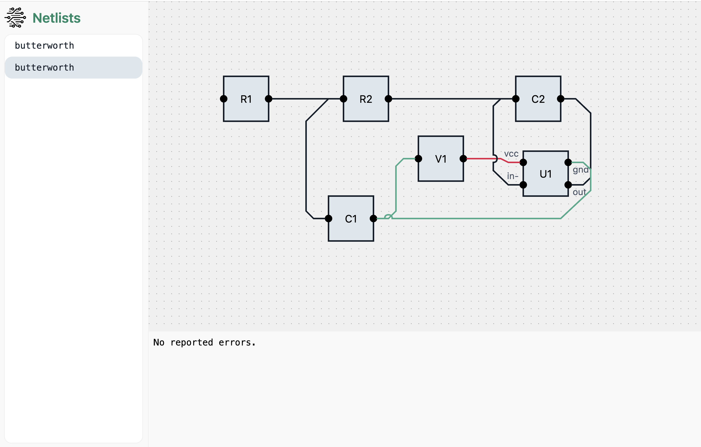

# Netlist Visualizer and Validator

A proof-of-concept web application that allows users to upload and visualize electronic netlists as interactive circuit graphs. The application also performs basic validation and displays results per submission.



## 🐳 Deployment

The project is containerized and ready for cloud deployment (e.g. AWS ECS, EC2, or similar). A Dockerfile and docker-compose.yml are included to build and run both frontend and backend services locally or in the cloud.

```
# From root
docker-compose up --build
```

The app runs at `http://localhost:3000`.

## ✨ Features

- ✅ **Upload Netlists**: Users can submit netlists in a custom JSON format.
- ✅ **Visualize Circuits**: Netlists are rendered as interactive component-level graphs using SVG.
- ✅ **Validate Submissions**: Enforces structural rules (e.g. non-empty names, GND connectivity).
- ✅ **Persistent Storage**: Netlists and results are stored in a MongoDB database.

## 🧠 Design choices

- FastAPI offers modern async Python performance with clear request validation.

- Validation rules are defined and enforced server-side to ensure consistency and security.

- Validation rules are easy to extend.  Just create a generator that satisfies the `NetlistRule` protocol and register it in `netlist_vis_backend/rules.py`.

- Exposes clean JSON-based REST APIs for netlist submission, retrieval, and validation results.

### 🚧 Remaining work

#### 🧭 Improved Graph Layout

While the graph is rendered successfully using JointJS, it currently uses a naive layout. JointJS provides the @joint/layout-directed-graph package to support automatic, directed layouts — ideal for visualizing circuit topologies. I explored this option, but due to time constraints, I was unable to fully integrate it. Adding this feature would significantly improve readability for larger or more complex netlists.

#### ✏️ Interactive Editing

This proof-of-concept focuses on visualization rather than editing. If future use cases require users to interactively build or modify netlists via the UI, I recommend considering JointJS+. It offers robust tools for building interactive diagram editors, including drag-and-drop components, link editing, and undo/redo functionality — features that would be complex and time-consuming to implement from scratch.

## 📄 Netlist Schema (example)

```json
{
  "name": "butterworth",
  "components": {
    "R1": {
      "kind": "resistor",
      "left_pins": [
        "in"
      ],
      "right_pins": [
        "n1"
      ]
    },
    "R2": {
      "kind": "resistor",
      "left_pins": [
        "n1"
      ],
      "right_pins": [
        "n2"
      ]
    },
    "C1": {
      "kind": "capacitor",
      "left_pins": [
        "n1"
      ],
      "right_pins": [
        "gnd"
      ]
    },
    "C2": {
      "kind": "capacitor",
      "left_pins": [
        "n2"
      ],
      "right_pins": [
        "out"
      ]
    },
    "U1": {
      "kind": "opamp",
      "left_pins": [
        "vcc",
        "in-"
      ],
      "right_pins": [
        "gnd",
        "out"
      ]
    },
    "V1": {
      "kind": "vsource",
      "left_pins": [
        "gnd"
      ],
      "right_pins": [
        "vcc"
      ]
    }
  },
  "connections": {
    "IN": [
      {
        "component": "R1",
        "pin": "in"
      }
    ],
    "VCC": [
      {
        "component": "V1",
        "pin": "vcc"
      },
      {
        "component": "U1",
        "pin": "vcc"
      }
    ],
    "N1": [
      {
        "component": "R1",
        "pin": "n1"
      },
      {
        "component": "R2",
        "pin": "n1"
      },
      {
        "component": "C1",
        "pin": "n1"
      }
    ],
    "N2": [
      {
        "component": "R2",
        "pin": "n2"
      },
      {
        "component": "C2",
        "pin": "n2"
      },
      {
        "component": "U1",
        "pin": "in-"
      }
    ],
    "OUT": [
      {
        "component": "C2",
        "pin": "out"
      },
      {
        "component": "U1",
        "pin": "out"
      }
    ],
    "GND": [
      {
        "component": "V1",
        "pin": "gnd"
      },
      {
        "component": "C1",
        "pin": "gnd"
      },
      {
        "component": "U1",
        "pin": "gnd"
      }
    ]
  },
}
```